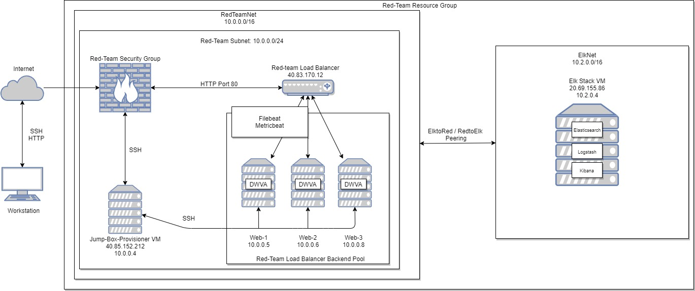
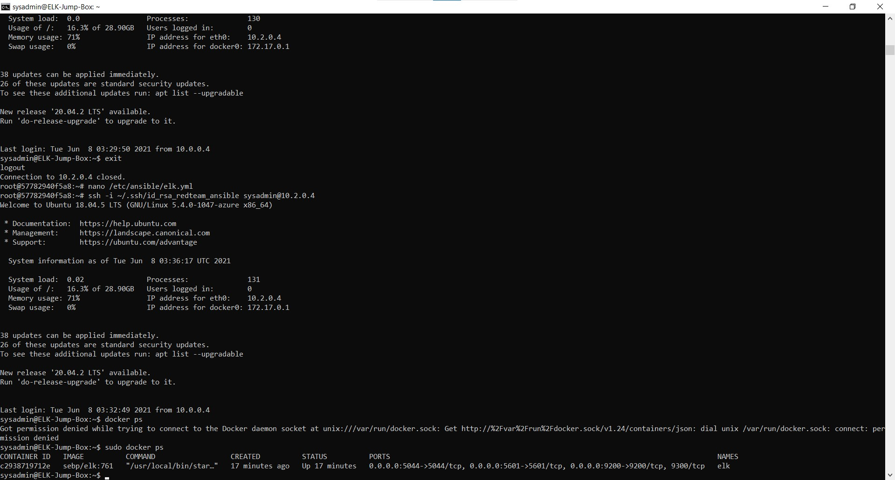

## Automated ELK Stack Deployment

The files in this repository were used to configure the network depicted below.



These files have been tested and used to generate a live ELK deployment on Azure. They can be used to either recreate the entire deployment pictured above. Alternatively, select portions of the yml and config file may be used to install only certain pieces of it, such as Filebeat.

- [ELK Deployment Playbook](https://uci.bootcampcontent.com/soysaucy328/sierra_edwin/blob/master/Project%201/ansible/elk.yml) 
- [Filebeat Playbook](https://uci.bootcampcontent.com/soysaucy328/sierra_edwin/blob/master/Project%201/ansible/filebeat-playbook.yml)
- [Filebeat Config file](https://uci.bootcampcontent.com/soysaucy328/sierra_edwin/blob/master/Project%201/ansible/filebeat-configuration.yml)
- [Metricbeat Playbook](https://uci.bootcampcontent.com/soysaucy328/sierra_edwin/blob/master/Project%201/ansible/metricbeat-playbook.yml)
- [Metricbeat Config file](https://uci.bootcampcontent.com/soysaucy328/sierra_edwin/blob/master/Project%201/ansible/metricbeat-config.yml)

This document contains the following details:
- Description of the Topologu
- Access Policies
- ELK Configuration
  - Beats in Use
  - Machines Being Monitored
- How to Use the Ansible Build


### Description of the Topology

The main purpose of this network is to expose a load-balanced and monitored instance of DVWA, the D*mn Vulnerable Web Application.

Load balancing ensures that the application will be highly accessible, in addition to restricting traffic to the network.
- Load Balancers will help againts DDos attacks and a jump box will help easily deploy containers to VMs 
-  

Integrating an ELK server allows users to easily monitor the vulnerable VMs for changes to the data and system logs.
- Filebeat monitors locations and logs and sends the information to logstash or elasticsearch.
- Metricbeat uses the metrics and stats and sends them to logstash or elasticsearch.

The configuration details of each machine may be found below.

| Name           | Function | IP Address | Operating System |
|----------------|----------|------------|------------------|
| Jump Box       | Gateway  | 10.0.0.4   | Linux - Ubuntu   |
| ELK SERVER     | Server   | 10.2.0.4   | Linux - Ubuntu   |
| WEB-1 VM (DVWA)| Server   | 10.0.0.5   | Linux - Ubuntu   |
| WEB-2 VM (DVWA)| Server   | 10.0.0.6   | Linux - Ubuntu   |
| WEB-3 VM (DVWA)| Server   | 10.0.0.8   | Linux - Ubuntu   |

### Access Policies

The machines on the internal network are not exposed to the public Internet. 

Only the ELK SERVER machine can accept connections from the Internet. Access to this machine is only allowed from the following IP addresses:
- 172.90.64.149:5601

Machines within the network can only be accessed by the jump-box.
- The Jump Box machine at 10.0.0.4 has access via ssh.

A summary of the access policies in place can be found in the table below.

| Name       | Publicly Accessible | Allowed IP Addresses   |
|------------|---------------------|------------------------|
| Jump Box   |       No            | 40.85.152.212 (via ssh)|
| Elk Server |       No            | 20.69.155.86:5601      |
| WEB-1      |       No            | 10.0.0.4 (via ssh)     |
| WEB-2      |       No            | 10.0.0.4 (via ssh)     |
| WEB-3      |       No            | 10.0.0.4 (via ssh)     |
| LB         |       No            | 40.83.170.12 (via http)|

### Elk Configuration

Ansible was used to automate configuration of the ELK machine. No configuration was performed manually, which is advantageous because...
- Ansible makes it easy to deploy application using playbooks to many machines.

The playbook implements the following tasks:
- ### Select which hosts to install 
```bash
---
- name: ELK
  hosts: ELK
  become: true
  tasks:
  ```

- ### Install docker.io
```bash
- name: Install docker.io
    apt:
      update_cache: yes
      name: docker.io
      state: present
 ```   

- ### Install pip3
```bash
- name: Install pip3
    apt:
      name: python3-pip
      state: present
```

- ### Install Docker Python Module
```bash
- name: Install Docker python module
    pip:
      name: docker
      state: present
```

- ### User more memory
```bash
- name: Use more memory
    sysctl:
      name: vm.max_map_count
      value: '262144'
      state: present
      reload: yes
```

- ### Download and launch a docker elk container
```bash
- name: download and launch a docker elk container
    docker_container:
      name: elk
      image: sebp/elk:761
      state: started
      restart_policy: always
      published_ports:
          - 5601:5601
          - 9200:9200
          - 5044:5044
```

- ### Enable service docker on boot
```bash
- name: Enable service docker on boot
    systemd:
      name: docker
      enabled: yes
```

The following screenshot displays the result of running `docker ps` after successfully configuring the ELK instance.



### Target Machines & Beats
This ELK server is configured to monitor the following machines:
- Web-1 10.0.0.5
- Web-2 10.0.0.6
- Web-3 10.0.0.8

We have installed the following Beats on these machines:
Metricbeat and Filebeat were installed on the following:
- ELK Server
- Web-1
- Web-2
- Web-3

These Beats allow us to collect the following information from each machine:
- Filebeat - logs events
- Metricbeat: system metrics and system statistics

### Using the Playbook
In order to use the playbook, you will need to have an Ansible control node already configured. Assuming you have such a control node provisioned: 

SSH into the control node and follow the steps below:
- curl https://gist.githubusercontent.com/slape/5cc350109583af6cbe577bbcc0710c93/raw/eca603b72586fbe148c11f9c87bf96a63cb25760/Filebeat >> /etc/ansible/filebeat-config.yml

- curl https://gist.githubusercontent.com/slape/58541585cc1886d2e26cd8be557ce04c/raw/0ce2c7e744c54513616966affb5e9d96f5e12f73/metricbeat >> /etc/ansible/metricbeat-config.yml

- Update the filebeat-config.yml and metricbeat-config.yml files to include...

```bash
hosts: ["10.2.0.4:9200"]
  username: "elastic"
  password: "changeme" 
```

```bash
setup.kibana:
  host: "10.2.0.4:5601"
```

- Run the playbook, and navigate to http://20.69.155.86:5601/app/kibana to check that the installation worked as expected.

### Playbook information
- Filebeat playbook: filebeat-playbook.yml - copy to /etc/ansible/roles
- Metricbeat playbook: metricbeat-playbook.yml - copy to /etc/ansible/roles
- The hosts file needs to be modified in order to set machines in the correct groups (webserver) (elkserver). Once machines are in the correct group the playbook will install on group listed.
- Check if the ELK server is running by going to: http://20.69.155.86:5601/app/kibana


## Commands needed to get Ansible container up
```bash 
sudo apt-get update #update all packages
sudo apt install docker.io #install docker
sudo service docker start #start docker
systemctl status docker #check docker status
sudo docker pull cyberxsecurity/ansible #Download docker ansible file
sudo docker run --name ansible -it cyberxsecurity/ansible /bin/bash #Run and create container called 'Ansible'
sudo docker start ansible && sudo docker attach ansible #Start ansible container and ssh into it
ansible all -m ping #Check connections of containers
```